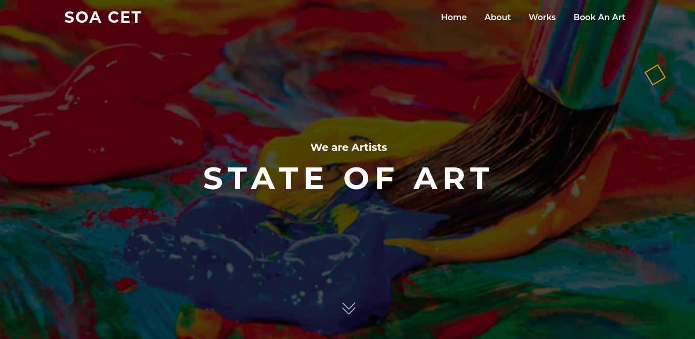

State of Art is an initiative taken by the College Union in the effort to foster a college driven by creativity that provides the opportunity for everyone to engage in diverse arts and culture. We believe that great artisanship inspires us, brings us together and teaches about ourselves and the world around us.

 

The primary vision of the gallery is to procure, propose & promote an exclusive range of Contemporary Art, Modern Art and all other genres of Painting by exploring and evaluating artists. This online gallery showcases some of the finest collections of arts, crafts and painting of our eminent art experts

Take a look at the website : [soacet.rahult.in](http://soacet.rahult.in)
